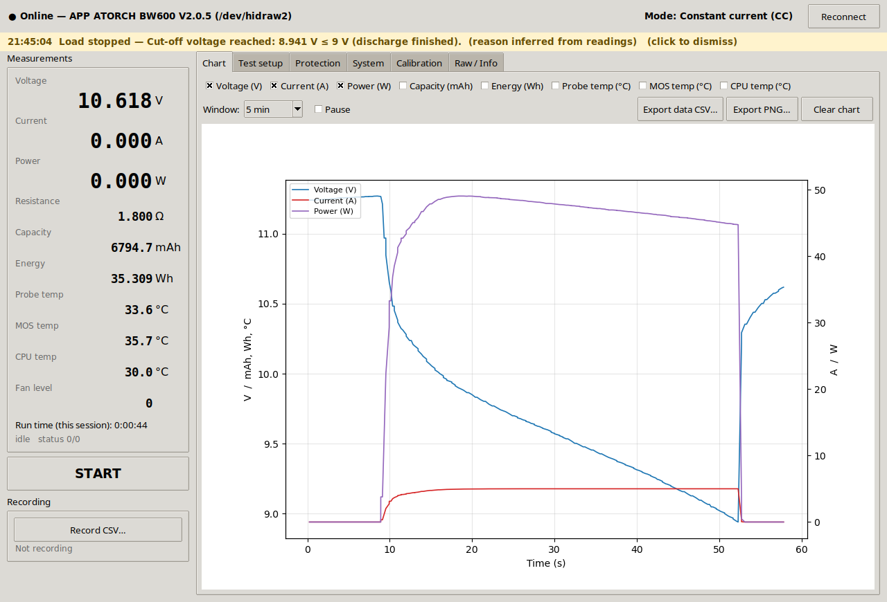

# ATORCH BW600 control for Linux

by SQ6EMM



Desktop application and CLI for the ATORCH BW600 electronic load and battery tester (firmware V2.0.5) over its USB-HID cable (`0483:5750`). It needs only Python 3.10+ with Tkinter and matplotlib, and talks to `/dev/hidraw*` directly.

## Setup

```sh
./install-udev-rule.sh        # once: gives your user access to the device (needs sudo)
python3 -m bw600              # start the GUI
pip install --user .          # optional: installs the `bw600` command
```

## GUI

- **Measurements:** voltage, current, power, resistance, capacity (mAh), energy (Wh), probe/MOS/CPU temperatures, fan speed (%), and the run state. There's also a big START/STOP button.
- **Chart:** live curves you can pick, with a 1 min to all-data window, pause, and export to CSV or PNG.
- **Recording:** continuous CSV log, with columns compatible with the vendor software.
- **Test setup:**
  - the operating mode (CC, CV, CR, CP, internal resistance, power-supply test, cable test, and the three charge/discharge programs), which can only be changed while the load is off
  - the set value, which means current, voltage, resistance or power depending on the device mode
  - cut-off voltage, charge full voltage and charge end current
  - the time limit
  - the number of cycles for the charge/discharge cycle test
- **Protection:** over-current, over-power, and over-temperature for both the probe (NTC) and the MOSFET.
- **System:**
  - working and standby brightness, and standby time
  - language
  - clearing the capacity counters and zeroing the readings
  - **factory reset, locked**: you type `RESET` and then confirm. It resets all settings *and* the calibration (to the factory calibration stored in flash), so a snapshot of your settings is saved first
  - saving settings to a JSON snapshot, and restoring one (everything except calibration)
  - the firmware version, a check of ATORCH's download page for newer firmware, and a download button
- **Stop reasons:** when the load switches itself off, a banner and popup say why, for example "Cut-off voltage reached: 8.941 V ≤ 9 V". The BW600 doesn't report a reason, so the app infers it from the last readings and your limits. It recognises:
  - the cut-off voltage
  - the time limit
  - the number of cycles for the charge/discharge cycle test
  - over-current, over-power and over-temperature (probe and MOSFET)
  - a completed charge
  - a lost input
  - a stop made on the device itself
- **Application alarms (Protection tab):** your own over-voltage, under-voltage and over-current limits, checked on every reading (4× a second), even while idle. The under-voltage alarm ignores readings below 0.5 V, which means nothing is connected. When one trips you get a red banner and a popup, and the load can switch off automatically. The limits are saved to `~/.config/bw600/alarms.json`.
- **Calibration:** voltage, current and temperature factors, **locked by default**. To change one you type `CALIBRATE` to unlock. The lock comes back after 2 minutes and after every write. Factors must be between 0.5 and 1.5, you confirm each change with the old and new values shown, and writing an unchanged value is skipped. The first time the app sees a device, it saves that device's calibration to `~/.config/bw600/calibration-<serial>.json`, and a Restore button (also locked) can put those values back.
- **Raw / Info:** a HID frame log and a hex-send box, for debugging.

The vendor software can't change the mode. This app can, because the mode commands were found by decrypting and disassembling the BW600 firmware (see Protocol below).

## CLI

```sh
bw600 status                       # measurements + all settings
bw600 monitor --csv log.csv        # stream readings, report stops with their reason
bw600 monitor --max-voltage 14.6 --min-voltage 10.5 --max-current 5   # with alarms
                                   # (add --warn-only to keep the load running)
bw600 start | stop                 # load on/off
bw600 mode cc                      # cc cv cr cp ir psu cable cdc cdcdc cycle (load off)
bw600 set value 2.5                # setpoint (A / V / Ω / W per mode)
bw600 set cutoff 3.0               # also: full-voltage full-current ocp opp ntc-otp mos-otp
bw600 set time 1:30                # time limit h:mm
bw600 set brightness 9             # 0..9; also: standby-brightness (0..9) standby-time language
bw600 set cycles 10                # cycles for the charge/discharge cycle test
bw600 action clear                 # also: zero, factory-reset
bw600 action factory-reset --unlock-factory-reset   # asks you to type RESET; saves a snapshot first
bw600 settings save [FILE]         # snapshot of all settings (default: ~/.config/bw600/)
bw600 settings restore FILE        # write a snapshot back (calibration excluded)
bw600 firmware [--download DIR]    # installed version vs. versions published by ATORCH
bw600 calibration show             # factors on the device + the saved backup
bw600 set cal-voltage 1.0017 --unlock-calibration   # asks you to type CALIBRATE
bw600 calibration restore --unlock-calibration      # write the backup back
bw600 raw --tx --seconds 3         # dump HID traffic
```

## Protocol

I reverse-engineered this from the vendor's Windows software.

**Host to device:**

- Frame: `55 05 <addr=01> <cmd> d0 d1 d2 d3 EE FF`, zero-padded to 64 bytes.
- Floats are big-endian IEEE-754.

**Device to host:** 64 bytes, `AA 05 <addr> <type> … EE FF`.

- **Type `03`, settings:** 11 big-endian floats starting at offset 4, in this order: set value, temperature/voltage/current calibration, cut-off voltage, full voltage, full current, OCP, OPP, NTC OTP, MOS OTP. After them come these bytes: mode, language, working brightness, standby brightness, standby time, time-limit hours, time-limit minutes, cycle count.
- **Type `05`, live data:** little-endian u32 values ÷ 1000, starting at offset 8, in this order: V, A, W, Ω, Wh, mAh, then the CPU, probe and MOS temperatures and the fan duty (%). Byte `0x34` is the run flag, and byte `0x3C` holds the sign bits.

| cmd | function | payload |
|-----|----------|---------|
| 03 / 05 | read settings / live data | poll |
| 20 | language | d0 = 1..4 (1 + 2 × English + a second display flag) |
| 21 | set value | float |
| 22 / 23 / 24 | working brightness (0–9) / standby brightness (0–9) / standby time | d3 |
| 25 | run | d0 = 1 on, 0 off |
| 26 / 27 / 28 | temperature / voltage / current calibration | float |
| 29 / 2A / 2B | cut-off voltage / full voltage / full current | float |
| 2C / 2D / 2E / 2F | OCP / OPP / NTC OTP / MOS OTP | float |
| 31 | time limit | d0 = value, d3 = 1 hours / 2 minutes |
| 32 / 33 / 34 | clear capacity / factory reset / zero readings | – |
| 37 | cycle count for the cycle test | d3 |
| 47 … 50 | select mode 0 … 9 (cmd = 0x47 + mode) | – |

`55 05 09 02 …` starts the firmware bootloader, so this tool refuses to send cmd `02`. Firmware updating isn't implemented.

The firmware also handles a few commands this app doesn't use:

- **07** asks for the cycle-test results: one type-`07` reply per completed cycle, each holding time, capacity and energy. It didn't answer when tested with no cycle test run, so it probably only replies once a cycle test has results.
- **35** (d0 = 1–3) chooses which record group the device's own TIME / GROUP / CAP / ELE records screen shows.
- **45, 46, 51** switch between screens.
- **02** with address `09` (`55 05 09 02 …`) restarts into the firmware updater. The app refuses to send it.

It doesn't handle 30 or 36.

### Fan

The fan can't be controlled over USB. The firmware sets it by itself: 30 % below about 50 °C, rising to 100 % near 80 °C, and 100 % whenever the power passes the limit for the current range. No command writes the fan duty or the fan level.

### How the mode commands were found

The vendor software never sends a mode command, so I read the firmware instead. The update file on ATORCH's site, for firmware V2.0.5, is a JieLi AC632N image and is encrypted:

- **File table:** each 32-byte entry is XOR'd with a CRC16-CCITT keystream seeded with `0xFFFF`.
- **Application area:** encrypted in 32-byte blocks with the chip key `0x8D07` XOR (offset ÷ 4), where the offset is counted from the start of the application area.

Once decrypted, the application runs on JieLi's q32s CPU and can be disassembled with the `objdump` in JieLi's Linux toolchain. The command dispatcher is a `tbh` jump table covering commands 0x03 to 0x51. Commands 0x47 to 0x50 write 0 to 9 to the mode byte and switch to that mode's screen. All ten mode commands were then checked on the device.

### Firmware updates

The firmware version is part of the USB product string (`ATORCH BW600 V2.0.5`). `bw600 firmware` and the System tab compare it with the files on ATORCH's BW600 page and can download the newest one. This app doesn't flash firmware: use ATORCH's Windows tool for that. The update protocol is only partly worked out (the vendor tool sends `55 05 09 02` to restart into the updater, then transfers the file in `CC …` packets), and a failed flash could leave the device unusable.
